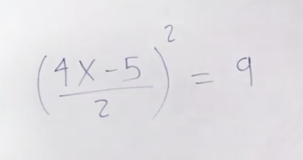

# mathematics fundamental

This repository is based on the course of fundamentals of mathematics for Data Science course. conducted at [Platzi](https://platzi.com/cursos/fundamentos-matematicas/) and applied to learn C language.

to run any file please type 
```
g++ [filename with extension] -o [filename without extension] && "[path current folder]/"[filename without extension]
```


## Index

1. Arithmetic.
2. Algebra
3. Polynomials


### Arithmetic

    Operations:

    - Sum/amount : (+)  2+2=4
    - Subtraction: (-)  2-2=0
    - Multiplication: (\*) 2\*2 =4
    - Division: (/) 2/2=1

    Workout:
    1. (-6)-(-7)*(-8)+ (-5) =

    2. (93+33+(4-26))+(3-6*2)=

    3. 12*(-2)(-1)(-3)=

    4. 8+(-7)*33=

    5. 147+(83+(5+25))=

    Solver => work_1.cpp

### Algebra

    Concepts:

    - change compound equation from number to letters
    - The roots is the inverse of the exponential and vice versa ( have attention with signal)

    Challenge:



# Polynomials
    Concepts:

    Polynomials some terms.
    in the equation  2x+ 5 => 2 and 5 are coefficients and x is the variable
    in the equation 
$$ 4xy^2 +3z $$

    4 and 3 are coefficients and x, y and z are the variables

## Notes
The folder with the name electronics contains an applied use of the theory in analog electronics calculations

Reference:

Floyd 